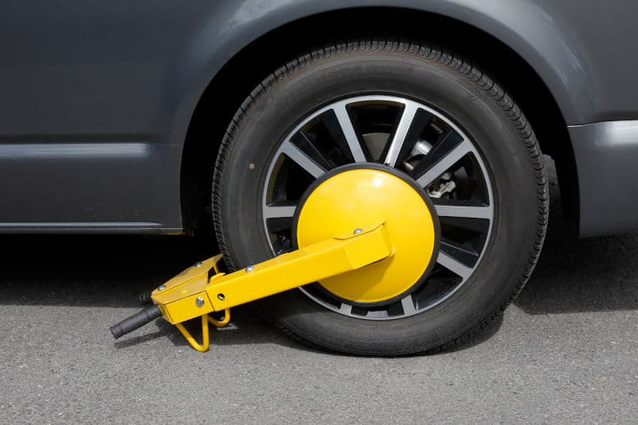

# DP

## Si lo Crees, lo Creas

_Elimina tus dudas, cambia tus creencias y suelta el pasado para alcanzar todo tu potencial_

**Brian Tracy**

### Introducción 

#### Adopta una mentalidad triunfadora

>"Los problemas son el denominador común de la vida. Son el gran ecualizador."
**ANN LANDERS**

Tu estado natural es ser feliz, saludable, alegre y lleno de emoción por estar vivo.

Si, por alguna razón, no te sientes o piensas de esta manera la mayor parte del tiempo, puede significar que algo no está bien con tu manera de pensar, sentir o reaccionar ante la vida. Tu objetivo principal es organizar tu vida de tal manera que te sientas feliz, gozoso y satisfecho la mayor parte del tiempo; elimines los pensamientos, las creencias, las ideas negativas o pesimistas que te detienen, y adoptes una mentalidad positiva de triunfador.

#### Eres una obra maestra.

Miguel Ángel vio la al El David en la pieza de marmol desde el principio y su unico trabajo fue remover todo lo que no era El David.

En el mismo sentido eres como El David atrapado en el marmol.

El gran objetivo de tu vida es remover todos esos miedos, dudas, inseguridades, emociones negativas y falsas creencias que te detienen. Tu trabajo es aprender lo que necesitas para vivir una vida larga y feliz.

#### Evita una vida de "desesperación silenciosa"

Muchas personas todavia son negativas, inseguras, enojonas. Tienen bloqueos mentales, todos arraigados en experiencias previas.

Las emociones negativas inpides que alcances tu máximo potencial.

#### Comienza con poco.

Es la historia de Brian. Él compró el coche de sus sueños y para comprarlo negoció su coche viejo como pago inicial, y el resto lo pagó en mensualidades por 5 años.

Al pisar el acelerador se movio muy rapido.

#### El poder de un pequeño cambio.

Brian llevó su coche al mecánico, y este le dijo que habia encontrado un problema en el carburador, una pieza clabe estaba insertada al revés, lo cual reducia la cantidad de combustible que entraba al motor, Hans remplazó esa pieza con otra nueva. y notó la diferencia al momento de tocar el acelerador, era realmente más rapido de lo que el estaba acostumbrado.

Este pequeño cambio de la valvula mejoró el rendimiento.

#### Una idea puede detenerte.

Imagina que comprar un coche lujoso, pero de alguna manera se instaló incorectamente los frenos de una llanta delantera. ¿Qué pasaria si tratas de mover el coche? pues este giraria en circulos.

Éste es el punto. Todo lo que necesitas es un bloqueo inconsciente en lo profundo de tu mente, una emoción negativa, o el recuerdo de una experiencia dolorosa, y tu vida puede dar vueltas en círculos indefinidamente, no importa que tan duro trabajes en el exterior, no progresaras -- ni en tus finanzas, ni en tu familia, ni en tu carrera ni en tu salud -- tanto como deberias.

Cuanto más trabajes en el exterior menos progreso harás y más insatisfecho te sentiras. Simplemente darás vueltas en circulos.

Tu obstaculo esta contenido en tus creencias negativas, que tienes acerca de tí que no están basados en hechos pero que aceptaste de todos modos.

La clave está en desafiar estas creencias y reemplazarlas con nuevas que mejoren tu vida.

