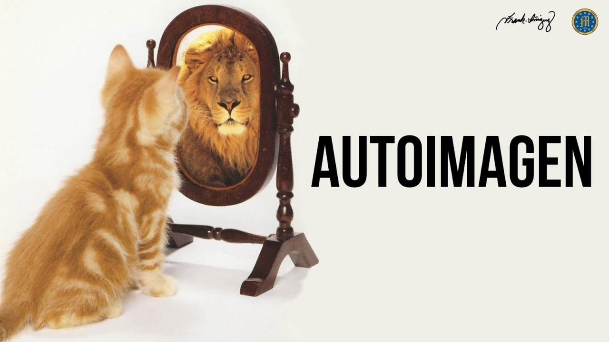
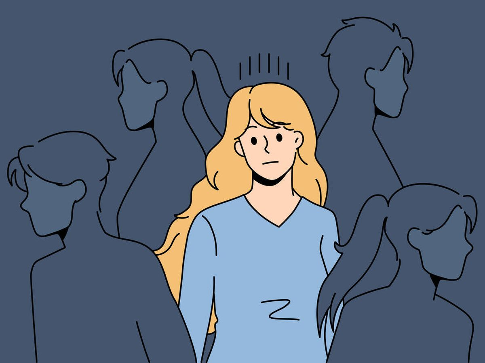
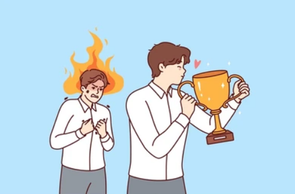

# DP

## Si lo Crees, lo Creas

_Elimina tus dudas, cambia tus creencias y suelta el pasado para alcanzar todo tu potencial_

**Brian Tracy**

### Introducción 

### Adopta una mentalidad triunfadora

>"Los problemas son el denominador común de la vida. Son el gran ecualizador."
**ANN LANDERS**

Tu estado natural es ser feliz, saludable, alegre y lleno de emoción por estar vivo.

Si, por alguna razón, no te sientes o piensas de esta manera la mayor parte del tiempo, puede significar que algo no está bien con tu manera de pensar, sentir o reaccionar ante la vida. Tu objetivo principal es organizar tu vida de tal manera que te sientas feliz, gozoso y satisfecho la mayor parte del tiempo; elimines los pensamientos, las creencias, las ideas negativas o pesimistas que te detienen, y adoptes una mentalidad positiva de triunfador.

### Eres una obra maestra.

Miguel Ángel vio la al El David en la pieza de marmol desde el principio y su unico trabajo fue remover todo lo que no era El David.

En el mismo sentido eres como El David atrapado en el marmol.

El gran objetivo de tu vida es remover todos esos miedos, dudas, inseguridades, emociones negativas y falsas creencias que te detienen. Tu trabajo es aprender lo que necesitas para vivir una vida larga y feliz.

### Evita una vida de "desesperación silenciosa"

Muchas personas todavia son negativas, inseguras, enojonas. Tienen bloqueos mentales, todos arraigados en experiencias previas.

Las emociones negativas inpides que alcances tu máximo potencial.

### Comienza con poco.

Es la historia de Brian. Él compró el coche de sus sueños y para comprarlo negoció su coche viejo como pago inicial, y el resto lo pagó en mensualidades por 5 años.

Al pisar el acelerador se movio muy rapido.

### El poder de un pequeño cambio.

Brian llevó su coche al mecánico, y este le dijo que habia encontrado un problema en el carburador, una pieza clabe estaba insertada al revés, lo cual reducia la cantidad de combustible que entraba al motor, Hans remplazó esa pieza con otra nueva. y notó la diferencia al momento de tocar el acelerador, era realmente más rapido de lo que el estaba acostumbrado.

Este pequeño cambio de la valvula mejoró el rendimiento.

### Una idea puede detenerte.

Imagina que comprar un coche lujoso, pero de alguna manera se instaló incorectamente los frenos de una llanta delantera. ¿Qué pasaria si tratas de mover el coche? pues este giraria en circulos.

Éste es el punto. Todo lo que necesitas es un bloqueo inconsciente en lo profundo de tu mente, una emoción negativa, o el recuerdo de una experiencia dolorosa, y tu vida puede dar vueltas en círculos indefinidamente, no importa que tan duro trabajes en el exterior, no progresaras -- ni en tus finanzas, ni en tu familia, ni en tu carrera ni en tu salud -- tanto como deberias.

Cuanto más trabajes en el exterior menos progreso harás y más insatisfecho te sentiras. Simplemente darás vueltas en circulos.

Tu obstaculo esta contenido en tus creencias negativas, que tienes acerca de tí que no están basados en hechos pero que aceptaste de todos modos.

La clave está en desafiar estas creencias y reemplazarlas con nuevas que mejoren tu vida.

### La verdad te hará libre.

Gran parte de la infelicidad y la insatisfacción en tu mundo de hoy se basa en cosas que crees conocer pero que no necesariamente son ciertas. Cuando cambies tus creencias autolimitantes cambiarás tu vida.

## Capitulo 1 

### Por qué la gente se estanca.

_Crecer significa cambiar y el cambio implica riesgo, ir de lo conocido a lo desconocido._

**George Shinn**

Para que puedas darte cuenta de la grandeza personal, necesitas comprender quien eres y cómo llegaste a donde estás hoy.

### No hay un manual de instrucciones para la vida ,¡así que crea el tuyo!

Al igual que una computadora poderosa sin manual, llegamos de la misma manera a la vida cargada con talentos y habilidades sin explotar. Pero no tienes un manual de instrucciones, y tienes que resolverlo todo por ti mismo. Y esto generalmente lleva años, si no toda la vida.

¿Te has preguntado cómo te convertiste en la persona que eres hoy  con tu combinación única de pensamientos, sentimientos, ideas, habilidades, miedos, esperanzas, ambiciones y aspiraciones?

### La magia de cambiar tu pensamiento.

La gran mayoria de las personas va por la vida sin pensar quién es ni cómo llegó a donde está hoy.

Toman el primer trabajo que les ofrecen. Se casan con la primera persona que está parada cerca, gasta su dinero en lo que alguien les sugiere.

El hecho es que tu mundo se crea en gran medida por los pensamientos que tienes, y las cosas que haces.

Cuando mejoras tu forma de pensar, mejoran tus acciónes y tus resultados. Cuando cambias tu forma de pensar, cambias tu vida.

**Unas palabras de Christins**

Un paciente estaba ansioso y deprimido, le dí ejercicios para la toma de decisiones y acciones que demostraban que él tenia el control de su vida, y su vida cambió por completo.

### Las leyes mentales

hay una serie de leyes y principios mentales.

Napoleon Hill: "Uno de los grandes secretos de la vida es nunca intentar violar las leyes naturales y ganar"

### LA LEY DE CAUSA Y EFECTO

Todo sucede por una razón. Solo por que no conozcamos la razón, eso no significa que una razón no exista.

_La ley de causa y efecto_ dice que por cada efecto o resultado en tu vida hay una causa o causas.

La manera más facil de tener éxito es encontrar a alguien que ya haya logrado lo que tú deseas lograr y luego hacer las mismas cosas que hizo esta persona, una y otra vez, hasta que obtengas los mismos resultados.

> **Ejercicio:** anota los nombres de tres personas a las cuales admires, ya sea por quienes son o por lo que han logrado. ¿Qué cualidad admiras más de cada una? ¿Cómo puedes desarrollar estas cualidades?

**Primera regla:**
Si haces lo que las personas exitosas y felices hacen, una y otra vez no habrá nada que te inpida obtener los mismos resultados que ellas

**La segunda regla:**
Si no haces lo que hacen las personas exitosas y felices, nada podrá ayudarte.

El mundo está lleno de personas que hacen lo que hacen las personas infelices, fracasadas y frustradas, y luego se sorprenden por obtener los mismos resultados. Pero esto no es cuestión de suerte. Es simplemente cuestión de ley.

Si comes saludable, te ejercitas regularmente y cuidas bien de tu cuerpo, estarás en forma y saludable. Si no haces esto no estarás saludable. Es cuestion de causa y efecto.

### Tu pensamiento es creativo

La aplicación más importante de la ley de causa y efecto: los pensamientos son causas y las condiciones son efectos.

Una vez que has iniciado la causa el efecto tiene lugar po si mismo. Una vez que has empujado la roca colina abajo, rueda por si misma por la ley de la gravedad. Una vez que has plantado una semilla positiva o negativa en tu mente, las flores o las malas hierbas crecerán. Puedes controlar la causa, pero el efecto ocurre automáticamente, lo quieras o no.

### Piensa en el éxito

En un estudio solo el 10% de las personas (las más felices) pensaban _lo que querían y cómo obtenerlo_. pensaron en sus objetivos y lás acciones para alcanzarlos.

>Ejercicio: elige algo que realmente quieras. Ahora imagina que ya lo has logrado. Describe cómo se siente haber alcanzado tu objetivo. ¿Cómo sería tu vida diferente si lograras algo que es importante para ti?

Cuanto más las personas exitosas pensaban de lo que querían y como conseguirlo, más ideas e intuiciones les llegaba. Y estas ideas las motivaron a tomar aun más acciones. lo que las movió más y más rapido hacia sus objetivos.

Pusieron su vida en una espiral ascendente de éxito y logro.

### El principio básico.

te conviertes en lo que piensas la mayor parte del tiempo.

Cuando tienes pensamientos claros y definidos sobre lo que quieres respaldados por la emoción positiva del entuciasmo, diriges tu energia y actividades hacia tus objetivos.

Si tu mente es un revoltijo de pensamientos pensarás en lo que quieres en algunas ocaciones y en lo que no quieres en otras.

Con el tiempo te comviertes en lo que piensas la mayor parte del tiempo para bien o para mal.

### LA LEY DE LA CREENCIA

_La ley de la creencia_ dice que todo lo que creas con emoción se convierte en realidad. No ves al mundo como es,sino como eres.

Si tienes creencias positivas y constructivas tomarás buenas decisiones y obtendras buenos resultados. Si tienes creencias negativas temorosas o enojadas tomarás las acciones incorrectas o ninguna acción, y obtendras resultados negativos.

> Ejercicio: consigue un cuaderno y tráelo con go durante todo el día. Toma conciencia de cómo percibes las situaciones. Cuando te enfrentas a una decisión, ¿resaltas los aspectos posi vos o consideras losnegativos primero? Haz un seguimiento de estos patrones de pensamiento y realiza un esfuerzo consciente para ver las cosas de manera optmista. Luego haz un seguimiento de cómo te sientes en general sobre tu día. Asegúrate de anotar esto.

### Toda las creencias son aprendidas

Afortunadamente toda las creencias son aprendidas. Si tienes creencias positivas que afirmen la vida, tendras una vida feliz y saludable. Serás popular y te llevaras bien con otras personas.

Si tienes creencias negativas y destructivas serás dudoso, temeroso, sospechoso, negativo y estarás en constante conflicto con otras personas.

Cualquier creencia que te limite, no suele ser cierta, son limitaciones que te has inpuesto al creer en ellas.

En el momento que dejas de creer que estás limitado tu vida se ilumina como un amanecer.

**Palabras de Christina**

🐱🐯
Tomar tus creencias autolimitantes y crear un objeto o animal concreto para representarlos te permite exteriorizarlos y ser más concsiente de la configuración mental desde la que estás operando.

Ser capaz de identificar cuando te sientes inseguro y conscientemente cambiar a un estado de seguridad y empoderamiento te da una sensación de control y aumenta tu autoestima.

> **Ejercicio:** ¿Cuáles son las tres cosas que quieres hacer pero que piensas que no puedes hacer? ¿Por qué no puedes hacerlas? ¿Quién te dice que no puedes hacer esas cosas? ¿Quién cree que puedes? ¿Alguna vez has intentado hacer estas cosas, o simplemente estás asumiendo que no puedes hacerlas?

### LA LEY DE LAS EXPECTATIVAS

_La ley de las expectativas_ dice: todo lo que esperas con confianza, se convierte en tu propia profecía autocumplida.

Si esperas ser feliz, exitoso, popular y querido por otros, te comportarás de tal manera que lo hagas realidad.
Si esperas tener una vida maravillosa, contribuir a la sociedad y ser respetado, eso también se convierte en tu profecía autocumplida.

Tal vez la mejor actitud que puedes desarrollar es la de una expectativa positiva, en la cual vivas la vida con confianza es perando que todo salga bien. Y rara vez te desepcionará.

La mayoria de las personas infelices tienen una actitud de expectativa negativa. Esperan ser decepcionadas, engañadas, o sobrecargadas. Esperan ser impopulares o poco queridas. Y sus expectativas también se hacen realidad.

### Puedes decidir

Lo único que puedes controlar en el mundo es tu forma de pensar.

Tus expectativas están en gran medida formadas por tus creencias. Si crees que eres buena persona, esperarás ser tratado de manera positiva. Y las personas responderán consciente o inconscientemente a tus expectativas, ya sea que las conozcan o no.

### LA LEY DE LA ATRACCIÓN

Algunas personas piensan que por _la ley de la atracción_ lo que sea que quieran inevitablemente se verá atraido hacia su vida.

Tu mente es un "imán viviente". De manera inevitable atraes a tu vida a las personas, los recursos y las experiencias que tienen tu emoción o tus pensamiento dominantes.

La emoción es la clave para entender esta ley. Tus emociones, positivas o negativas son como una carga eléctrica que influye en tu magnetismo y te atrae hacia lo que sea que estés emitiendo

### La ley de la atracción en acción

¿Qué significa? cuando tienes claro lo que quieres, estableces un campo de energía de fuerza que lo atrae hacia ti y te atrae hacia eso. El componenete esencial para que funcione esta ley es la creencia o la fé. La menor duda o la negatividad con respecto a lo que quieras saboteará el proceso de atraerlo a tu vida.

> **Ejercicio:** imagina que vas a comprar un coche nuevo decide qué coche te gustaria tener y el color de tu elección. Durante los proximos días, observa la frecuencia con la que ves ese coche. Lo notarás en todas partes.

**La ley de la resonancia simpática.**

Tambien hay una subley: La _Ley de la resonancia simpática_.

A menudo conocerás a una persona con la que tienes una resonancia simpática desde el primer momento. Kahlil Gibram escribió, el su libro _El Profeta_: "En el amor debe haber una comunicación instantánea en el primer momento de la cita, o nunca sucederá".

Muchas personas se sienten atraidas por otras como imanes, sus ojos se encuentran en medio de una habitación llena de gente.

**La Ley de la vibración.**

Otra subley de la ley de la atracción es la _ley de la vibración_, dice que todo el universo es energía en movimiento, con cada sustancia vibrando en diferentes frecuencias. Tus pensamientos tambien vibran, en un nivel tan fino que tus hondas de pensamiento pueden viajar a través de cualquier sustancia, y en largas distancias, de forma instantánea.

A lo largo de tu vida tendrás experiencias como ésta: estás hablando de un amigo que vive en otro país, alguien que no hasvisto en años. En medio de tu conversación, el teléfono suena y resulta que es tu amigo. Y le dices, con sorpresa: “¡Estábamos hablando de ti!”.

### LA LEY DE LA REPULSIÓN

lo opuesto a la ley de la atracción es _la ley de la repulsión_. Cuando tienes pensamientos negativos y aprehensivos sobre el dinero, sobre lo poco que tienes y cuánto cuesta todo, creas un campo de energía de fuerza negativa que aleja el dinero, y las oportunidades de tu vida.

Lo peor que puedes hacer si quieres tener éxito financiero es criticar a otras personas que lo están haciendo bien o que están ganando más que tú. Este comportamiento se basa en la envidia y el resentimiento, dos de las peores emociones negativas. Elimina todas las esperanzas de éxito en tu vida.

### LA LEY DE CORRESPONDENCIA

Mi ley favorita es _La ley de correspondencia_ que dice: tu mundo exterior es un reflejo de tu mundo interior.

Es por eso que la biblia dice: "Como es adentro, es afuera".

Napoleon Hill escribió que para ser financieramente independiente debes desarrollar una "conciencia de prosperidad".

Una ves que tengas esta conciencia, comenzarás a ver todo tipo de oportunidades, conocerás nuevas personas, leeras libros o artículos relevantes y tendras grandes ideas.

Desafortunadamente la mayoria tiene una _conciencia de pobreza_. Se preucupa por cuanto cuesta todo y piensa que cuesta demaciado. Es cautelosa con su dinero. A menudo, debido al condicionamiento de la infancia, su actitud es: "¡No me lo puedo permitir!"

### Buenos reflejos

Segun la _ley de correspondencia_, tu mundo exterior de relaciones será un reflejo de cómo te sientes por dentro. Cuanto más te gustes y te respetes, más te gustarán y respetarás a los demás. Cuanto más te gusten y respetes a los demás, más les gustarás y mejores serán tus relaciones en todas las areas de tu vida.

Tu mundo exterior de salud será un reflejo de tu mundo interior de actitudes hacia la dieta, el ejercicio, y el bienestar personal. Si te visualizas en forma, delgado y saludable por dentro, pronto serás una persona en forma, delgada y saludable en el exterior.

Tu mundo exterior de éxito será un reflejo de tu preparación interna y tu capacidad de utilizar tu conocimiento y tus habilidades

Debido a estas leyes, cuando cambias tu forma de pensar, cambias tu vida. Y no hay otra manera.

Las personas infelices están convencidad de que pueden cambiar los aspectos externos de su vida, sin cambiar las actitudes mentales internas. Esto es Imposible.

### El descubrimiento del auto concepto

Es el mayor avance en la comprención y el desbloqueo del potencial humano.

Cada persona comienza sin pensamientos, creencias y opiniones. Todo lo que sabes acerca de ti ha sido enseñado desde la infacia en adelante.

### El recien nacido

El niño viene al mundo completamente indefenso.

La visión del mundo del niño, segura o insegura está determinada por la forma en que se trata en los primeros tres a cinco años de vida.

Cuando los padres le dan al niño amor, calidez, aprobación, desarrolla la creencia de que vive en un mundo seguro.

### Sé espontáneo y desinhibido

Los niños llegan al mundo con dos características comunes: son desinhibidos y espontáneos. 

Debido a que son espontaneos no les preucupa lo que otros piensen acerca de ellos. Hacen o dicen lo que piensan.

Es tu derecho natural: ser espontaneo y desinhibido cuando se trata de ti y de tus sueños. Cuando bebes una o dos copas de vino, regresas a tu estado natural, no te preucupa lo que las personas piensen, sientan o por como reaccionarán.

### Los principales dos patrones de hábitos negativos

En psicologiá hay dos patrones de hábitos negativos principales: el patrón de hábito negativo inhibidor y el patrón de hábito negativo compulsivo. Los llamamos _miedo al fracaso_ y _miedo al rechazo._ son los dos principales obstáculos para el éxito.

El primero de ellos, el miedo al fracaso se aprende cuando se le grita o se castiga fisicamente al niño por intentar o probar cosas nuevas.

### "NO PUEDO HACERLO"

Esto pronto crea en el niño el miedo al fracaso, que se expresa en el pensamiento y en el sentimiento de "¡No puedo!". ese miedo al fracaso puede continuar en toda la vida adulta. Cada vez que el adulto se enfrenta a una nueva oportunidad para probar algo nuevo, la reacción automática en el plexo solar, será. "¡No Puedo!".

Por el resto de la vida de la persona, el miedo al fracaso tendrá una influencia para determinar lo que hace, a dónde vá, los trabajos que elige el círculo social, la forma en que cría a sus hijos y trata a su cónyugue y cualquier otro factor de su vida.

La idea de "¡No Puedo!" es una hierba que necesita ser arrancada de nuestro jardir mental. Ese patron de pensamiento se ha convertido en un hábito, y los hábitos se pueden cambiar. 😊

### EL MIEDO AL RECHAZO

El segundo bloqueo es el patrón compulsivo de hábito negativo, el miedo al rechazo o a la crítica. Este patron de hábito se aprende cuando el niño el víctima del amor condicional.

Papá y mamá le dá y le quita el amor para que el niño haga lo que ellos quieran que hagan, esto crea una dependencia del amor de sus padres por su sensación de seguridad.

Esto se expresa en el pensamiento: "¡Tengo que hacerlo! Tengo que hacer lo que mamá y papá quieren. Tengo que hacer lo que ellos quieren que haga".

### EL PATRÓN CONTINÚA

Cuando el niño crece, el patrón de hábito negativo inhibitorio, hace que se vuelva hipersensible a las opiniones de los demás. 

En casos extremos, el adulto no puede tomar una decición; siempre tienen que obtener la aprobación de alguien, o de varias personas, antes de que puedan comprar una prenda de vestir o un coche nuevo.

Se siente muy incómodo ante la sola idea de tomar una decisión en la que alguien más lo desapruebe o lo critique.

El patrón de hábito negativo compulsivo se siente en forma de estres

> En una relacion si no hay autenticidad se puede derumbar, por que esa persona insegura intenta ser lo que cree que la otra persona queria que fuera.

> Para establecer una conexion auténtica con otra persona nesesita tener una relación con ella misma

### Deficiencia de amor

Un niño que ha experimentado dificiencia de calcio en la infacia puede ser reconocido en la edad adulta por sus piernas arqueadas. Pero cuando un niño que ha sido criada con deficiencia de amor lo puedes reconocer cuando interactuas  con personas infelices, frustradas, enojadas o deshonestas.

Todo lo problemas de los adultos se remontan a la _retención_ o a la _falta_ de amor en la infacia, y cuando le agregas crítica destructiva, produce un adulto que tiene: el habito inhibidor y el compulsivo que va por la vida diciendo: "No puedo, pero tengo que hacerlo" o "tengo que hacerlo pero no puedo"

Prácticamente todas las emociones negativas que hacen que una persona no avance  en la edad adulta son platadas como semillas por la crítica o la negligencia de los padres en los primeros años de vida.

Cuando ves a un adulto disfuncional, ves los resultados de una infancia disfuncional. 

### Cambiando tu autoconcepto

¿como corriges las emociones negativas en tu mente subconciente?

pues cambianto tu autoconcepto que se compone del paquete de creencias de otros que has asimilado acerca de ti.

Siempre actuaras en el exterior de acuerdo con lo que crees sobre tí en el interior.

tu autoconcepto se compone de tres partes: tu yo ideal, tu autoimagen y tu autoestima.

### TU YO IDEAL

Tu yo ideal está compuesto de los valores, virtudes y cualidades que más admiras en ti y en otras personas.

Es un compuesto de la persona que te gustaría ser en el futuro. 

Cuantas más cosas quieras ser, hacer y tener en tu vida, más poderosa será la influencia que tu yo ideal tendrá en tu comportamiento.

Las personas exitosas tienen muy claro sus ideales. Establecen la integridad como el principio organizador de su vida.

Las personas inflices y fracasadas tiene un yo ideal poco claro o inexistente, compromenteran sus valores y principios con la más minima ventaja o beneficio. Ellos nunca son felices

### Ten claro tus valores

Elegimos los valores más importantes para nosotros

Una vez que las personas tienen claro sus valores y su yo ideal toda su vida comienza a cambiar

Una persona con ideales claros comienza a atraer a su vida a más personas y más recursos que estén en armonia con el ideal de la mejor persona que puede ser.

### TU AUTOIMAGEN

La segunda parte de tu autoconcepto es tu autoimagen "espejo interior"

Las personas felices tienen autoimágenes positivas.

En la psicologia de la autoimagen se dice: "La persona que ves es la persona que serás"

Puedes cambiar tu autoimagen alimentando tu mente con imágenes positivas de la persona que te gustaría ser, actuando de la manera que te gustaría actuar

en 1950 muchas personas aprendieron que cuando se visualizaban a sí mismas lo mejor que podian, su mente subconciente alteraba el lenguaje corporal, el tono de voz y la personalidad para ser coherentes con la nueva imagen  mental.

Cuando tienes tu yo ideal claro, es más facil mejorar continuamente tus pensamientos, tus conductas y tus actividades

### TU AUTOESTIMA

La tercera parte y la más importante de tu autoconcepto es tu autoestima. Es la base de tu personalidad. Es el "núcleo del reactor" de tu generador de tu energía emocional.

La mejor definicion es: cuánto te gustas (cuanto te quieres). Cuanto más te gustes, mejor estarás en cada parte de tu vida. Cuanto más te gustes más te gustarán los demás. Cuanto más te gusten los demás, más les gustarás y más querran comprarte, estar asociados contigo, estar casados contigo y tenerte como amigo.

A lo largo de tu vida encontrarás que las personas con la mayor autoestima tienen las personalidades más positivas y son las más populares donde quiera que vayan. Parece haber una relación directa entre la autoestima, el éxito y la felicidad en cada área de la vida.

### Tiempo de reaccíon rápido

Así como te conviertes en lo que piensas, también te conviertes en lo que dices la mayor parte del tiempo. La mayoria de tus emociones está determinada por la forma en que hablas contigo a lo largo del día.

Cuando hablas contigo de una manera fuerte y positiva estos comandos son aceptados por tu mente subconciente y de inmediato influye en tus pensamientos, sentimientos y tu comportamiento.

Las palabras más poderosas que puedes usar para desarrollar tu autoestima son: "¡Me gusto a mí mismo!" 

Cada vez que dices: "¡Me gusto!", tu autoestima se incrementa a la par tu automimagen y tu personalidad entra en equilibrio, comienzas a evolucionar y a crecer de una manera positiva

### Toma el control de tu evolución como persona

No importa qué te haya paso en la primera infancia para disminuir tu autoestima o dañar tu autoimagen, como adulto puedes tomar el control completo de la evolución de tu propia personalidad

Comienza hoy repitiendo las palabras mágicas "Me gusto" una y otra vez 10, 20, 30, 50 veces al día.

Si te sientes infeliz, preucupado, angustiado, puedes cancelar las emociones negativas repitiendo: "¡Me gusto!"

Cuanto más te gustes más feliz y más seguro te volverás. Cuanto más te gustes, más optimista y alegre serás. Cuanto más te gustes, más cambiará tu vida para mejorar.

>  _**Ejercicio:** escribe una lista de las tres cualidades que más te gustan de ti. Por ejemplo: ¿por qué eres una buena persona? ¿Cuáles son tus mejores cualidades? ¿Qué te hace ser un valioso amigo, cónyuge o padre? Siempre que pienses en estas cualidades, puedes mirarte en el espejo y decir con convicción: “¡Me gusto!”._

## Capítulo 2

### Qué te detiene

_Las cosas más grandiosas --grandes pensamientos, descubrimentos, inventos--, generalmente han sido nutridas en la privación , a menudo ponderadas por la tristesa, y finalmente establecidas como dificultad._ SAMUEL SMILES

Cada niño llega al mundo con un potencial puro.

La gente de hoy puede vivir más tiempo gracias al avance de la medicina y tecnologia.

Los niños nacen optimistas, completos, intrépidos y deshinibidos, curiosos y deseosos ¿Alguna vez has visto un bebé negativo?

### Errores que cometen los padres

Por parte de los padres los niños a temprana edad comienzan a experimentar críticas destructivas y falta de amor.

La crítica destructiva es el mayor enemigo individual, la critica destructiva mata el alma pero deja al cuerpo caminando.

Cuando los padres intentan controlar a sus hijos, dándoles amor y quitándoselo, siembran las semillas de la inseguridad profunda dentro de ellos. Esta inseguridad se manifiesta en una plétora de problemas emocionales y mentales, duda, anciedad, inadecuación y de no merecer nada bueno en la vida, hasta falta de motivación, busca la perfección, incapacida de enfrentar problemas o lidiar con conflictos de manera efectiva.

### Las dos emociones negativas principales

Hay muchas emociones negativas, pero casi todas están arraigadas en dos principales: miedo al fracaso y miedo al rechazo.

El miedo al fracaso surge cuando la persona ha sido criticada destructivamente, se manifiesta en la vida adulta como el temor a la perdida del dinero, la pérdida de la salud la pérdida de la seguridad y la perdida del amor de otras personas. No importa cuanto logren en sus carreras, les atormenta el miedo a que se lo quiten y tengan que volver a empezar sin nada.

El miedo al rechazo se experimenta como un miedo a la crítica, la persona se vuelve hipersensible a los pensamientos, opiniones, palabras de otras personas, tienen temor a no ser del agrado de otros.

Las personas con este miedo tienen temor a la verguenza o al ridiculo de cualquier tipo, especialmente en presencia de otros.

El miedo al rechazo es la causa raiz del miedo a hablar en público, por encima del temor a la muerte.

Unas palabras de Christina

> _Cuando te estás preparando para hablar en público y el pánico escénico comienza a aparecer, la clave es convencerte de que tu audiencia quiere que tengas exito. Ellos no están ahí para juzgarte; están ahí para aprender o escuchar._

### Imagina que no tuvieras limitaciones

¿Que papel juega el miedo en su vida y en sus decisiones?

Primero preguntamos: "imagina que tuvieras todo el dinero que pudieras gastar por el resto de tu vida. ¿Qué empezarías a hacer o dejarías de hacer?".

Esta pregunta te revela muchas cosas.

hay muchas situaciones en tu vida que cambiarías drastica e inmediatamente si no tuvieras miedo a la pobreza.

Las personas diseñan su vida para compensar sus miedos. Aceptan trabajos de nivel inferior al que son capaces a cambio de seguridad. Permanecen en relaciones infelices en lugar de arriesgarse a estar solas. Eligen amigos pasivos y no críticos para estár seguras de nunca ser criticadas, avergonzadas o rechazadas

**Unas palabras de Christina**
> _El miedo a no tener o no ser lo suficiente es uno de los obstáculos más comunes que impiden que las personas avancen, especialmente en el aspecto profesional. Asisti a un taller profesional, y una de las actividades fue identificar las cosas que nos impedian avanzar. El 90% de los asistentes necesitaba más capacitacion, más experiencia, más conocimiento. Antes de la actividad cada uno explicó su nivel de exito profesional. Fue sorprendente escuchar que incluso aquellos con los curriculums más impresionantes dudaban de sí mismos._

### LA GRAN PREGUNTA

la segunda pregunta es: "¿Qué gran cosa te atreverias a hacer si supieras que no puedes fallar?"

Si tuvieras garantizado el exito en cualquier cosa, ya sea grande o pequeña, a largo o corto plazo, ¿qué objetivo tan grande, emocionantey desafiante te fijarías?

Esta pregunta te ayuda a identificar los miedos que te están deteniendo. Si tuvieras garantizado el éxito probablemente te comprometerías con tu "deseo del corazón"

### La jerarquia de necesidades.

Abraham Maslow estudió a las personas felices, y desarrolló su famosa jerarquia de necesidades.

Concluyó que cada persona tiene 5 necesidades básicas que deben ser satisfechas

1. _supervivencia_ es la preservación de la vida.
1. la _seguridad_ es cuando el individuo tiene suficiente comida, ropa, refugio y dinero para que ninguna de estas necesidades sea apremiante.
1. La _pertenencia_ cada persona tiene un profundo deseo de ser parte de un grupo para ser reconocida y aceptada.

### DEPENDIENDO DE LOS DEMÁS

Es importante la necesidad de contacto humano y pertenencia para comprender como avanzar cuando te sientas estancado.

Como bebés, a medida que nos hacemos adultos, transferimos nuestros apegos a nuestros pares u a otras personas importantes, y dependemos de esas relaciones para nuestra salud emocional e incluso para nuestra supervivencia.

La razón por la cual  el miedo al rechazo es tan poderoso es que la idea de estar completamente solos se siente emocionalmente amenazante para la vida.

Dependemos tanto de la acepación de los demás que reprimimos nuestras verdaderas necesidades para mantener a nuestros y compañeros cerca

**Unas palabras de Christina** 

> Trabajé con un joven que habia descubierto que cuando tenia emociones fuertes, positivas o negativas, sus padres no respondian bien. Se alejaban de él. Pronto aprendió a reprimir sus sentimientos y sus reacciones para no perder la aprobación de sus padres. Cuando creció, se desconectó tanto de sus verdaderos sentimiento como resultado tenia baja autoestima y confianza. Le llevó mucho tiempo aprender que sus deseos y sus necesidades eran tan válidos como las de cualquier otra persona.

### NECESIDADES DE DEFICIENCIA VS NECESIDADES DEL SER

los tres primero tipos de necesidades (supervivencia, seguridad, y pertenencia) se define como "necesidades de deficiencia". En ausencia, el individuo excluye todo lo demás. Pero una vez que se satisfacen, el individuo se mueve hacia la satisfacción  de la "necesidad del ser", la cuarta de las cuales es la _autoestima_.
Casi todo lo que hacemos hoy en la vida es para lograr sentimientos de autoestima. Tu autoestima, cuánto te gustas a ti mismo, el el nucleo de tu personalidad y determina la calidad de tu vida emocional.

En la jerarquia de Maslow, una vez satisfecha la necesidad de autoestima, el individuo se mueve al nivel más alto: la satisfacción de la _autorrealización_. Segun Abraham Maslow consiste en "convertirse en todo aquello que uno es capaz de llegar a ser".

### NECESIDADES MAYORES

Más tarde, Maslow llegó a la conclusión de que hay dos necesidades aún más elevadas que surgen naturalmente despues de satisfacer las necesidades de supervivencia, seguridad, pertenencia, autoestima, y autorrealización. Estas son las necesidades de _verdad_ y _belleza_ que se resume en: filosofia, literatura, poesia en busca de la verdad y joyas, casas hermosas todo en busca de la belleza.

### La Persona Completamente Funcional

El psiquiatra  William Glasser definió a una persona que ha alcanzado los niveles más altos de desarrollo mental y emocional como _completamente funcional_. Ésta es una persona con alto autoestima y satisfacción individual, es relajada. La caracteristica más notable es que es completamente "no defensiva".

La persona completamente funcional no siente que tiene que justificarse o explicarse ante nadie por nada. Vive su vida de acuerdo con sus propios pensamientos, sentimientos, valores e ideales. Es cálida, amable, feliz, encantadora y posee una "personalidad madura y totalmente integrada". Alcanzar este nivel es uno de nuestros objetivos más importantes.

### ¿QUÉ NOS DETIENE?

la respuesta es: Las emocines negativas.

Debido a la critica destructiva y a la falta de amor de niños. A medida que se convierten en adultos, estas emociones pueden volverse más y más intensas.

Las principales emociones negativas que experimentan las personas son el miedo , la duda, la preucupación, la envidia, los celos, el resentimiento, la indiferencia  y los sentimientos de inadecuación especialmente en comparación con los demás.

El miedo, la duda  y la preucupación surgen cuando el niño es continuamente criticado cada vez que comete un error de cualquier tipo. 

Incluso si logran algo que vale la pena nunca es suficiente para sus padres

### CONVERTIRSE EN UNA PERSONA COMPLETAMENTE FUNCIONAL

Tu objetivo es convertirte en una persona completamente funcional, pero la mayoria de nosotros no lo ha logrado. La mayoria de las personas mira a los demás para validad las decisiones que toma. A menudo cuando alguien más tiene una opinión diferente o toma decisiones contraras a la suya, las personas indecisas pueden sentirse inseguras  o amenazadas. Preguntan: "¿Qué opción es la mejor?"

**Unas palabras de Christina**

> Jon es un hombre de mediana edad, lucha por ser decisivo y proactivo. A menudo busca la opinion de su madre y su hermano. Despues de trabajar meses con Jon me di cuenta que cada vez que buscaba el consejo de su madre. Si ella estaba de acuerdo y hacia lo que ella decia su madre era solidaria y cariñosa. Sin enbargo si hacia algo que ella no aprobara  dejaba de hablar con él durante semanas. Se sentia incapaz de avanzar.

> He trabajado con varios casos similares. Y lo que los detiene y los mantiene estancados el el miedo de que si hacen algo nuevo o diferente podrian perder el amor o la aprobación de una persona importante en su vida. Como resultado, se quedan estancados en el mismo lugar durante años.

### La Envidia y el Resentimiento

La envidia y el resentimiento son emociones negativas que surgen de profundos sentimientos de inadecuación e inferioridad.

La envidia es una de las peores emociones negativas. Es el único de los "siete pecados capitales" que no hay recompensa

La envidia no tiene ningun efecto sobre el objetivo y no le da ningún beneficio o placer a la persona obsesionada con la envidia.

La envidia se aprende de uno o ambos padres continuamente afirma que las personas exitosas son malas y deshonestas.

Lo desafortunado de la envidia es que nunca puede ser satisfecha. En todo caso, crece y empeora con el tiempo. Y causa mucho más daño a la persona que experimenta la emoción que a la persona o al grupo al que va dirigido.

### LA ADMIRACIÓN ES POSITIVA

